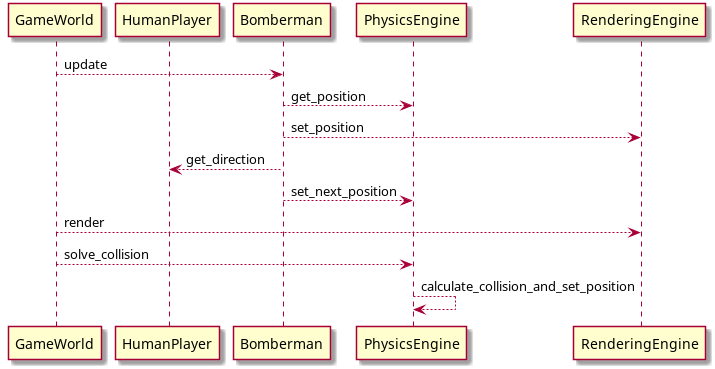
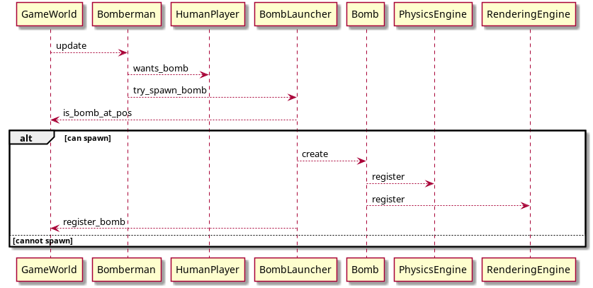
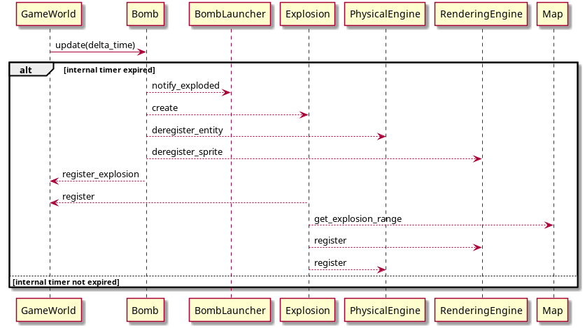

# [UC:1] As player I want my Bomberman to move

## [UC:1.1] As player I want to be able to see a board with Bomberman, grass and other stuff

## [UC:1.2] As player I want to be able to move Bomberman by keyboard input

# [UC:2] As player I want to place bombs that explode

## [UC:2.1] As player I want a bomb object to appear on map at my current positon
Bomb should appear when proper key is pressed.

## [UC:2.2] As player I want my bomb to explode when its timer expided

## [UC:2.3] As player I want explosions of my bombs to last a prededined time interval

