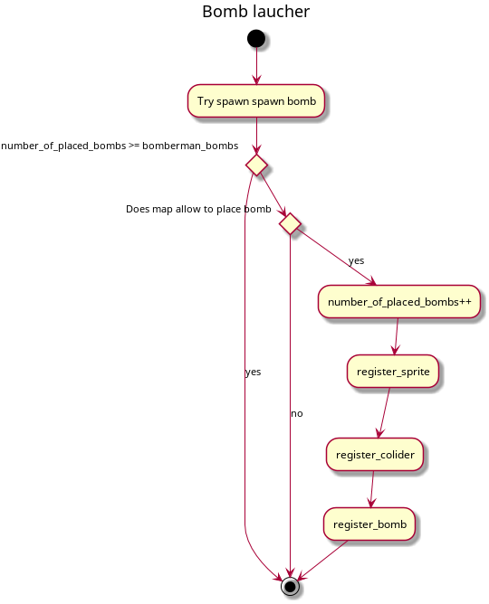
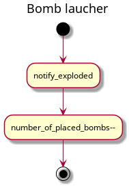
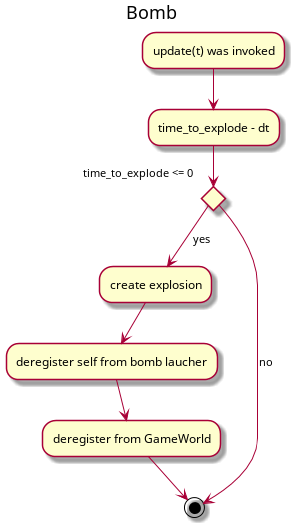
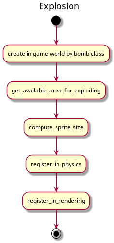
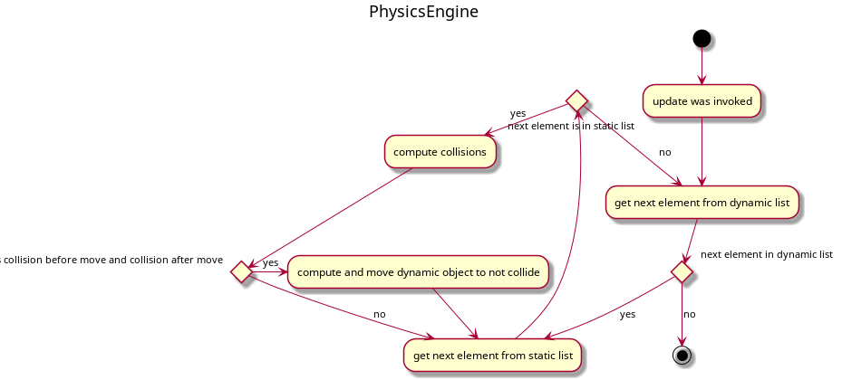

# [UC:1] 

# [UC:2] Bomb placement and explosions

## [UC:2.1] Bomb placement by a player
### Bomb Launcher

## [UC:2.2] Bomb explosion mechanics
### Bomb Launcher

### Bomb

### Explosion

## [UC:3.2] End of explosion
### PhysicsEngine

